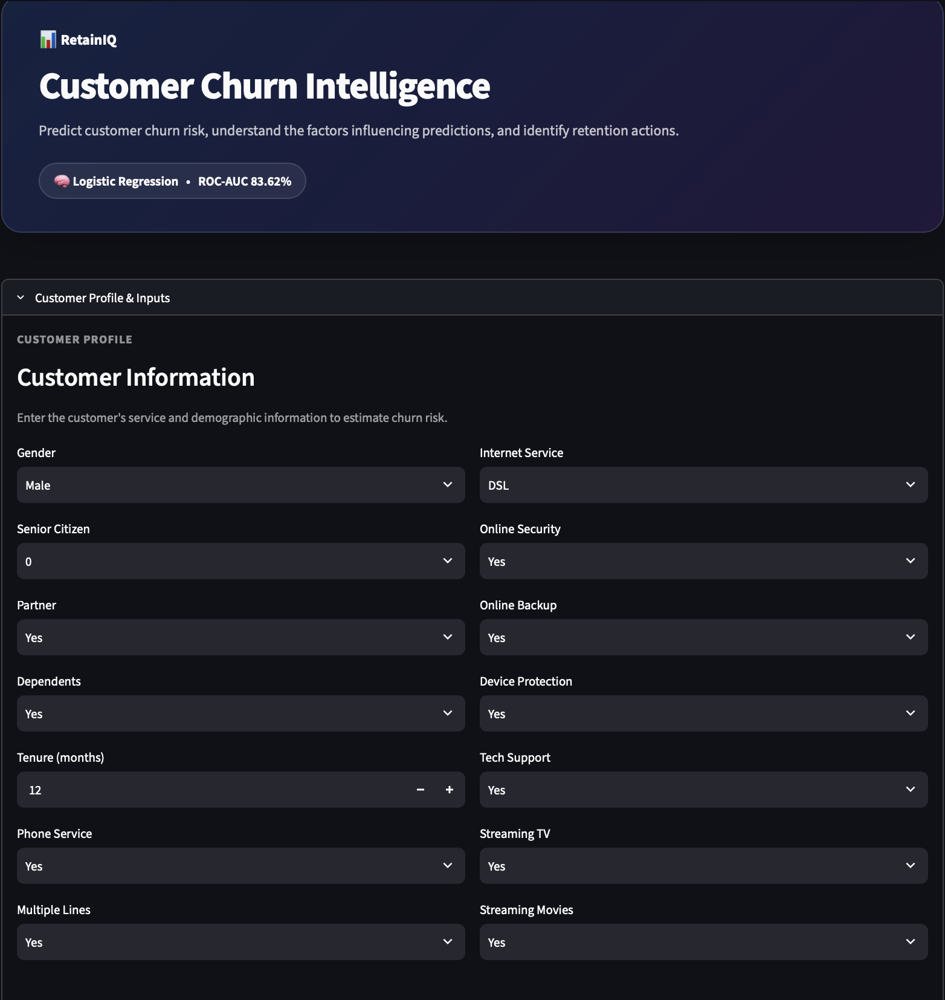
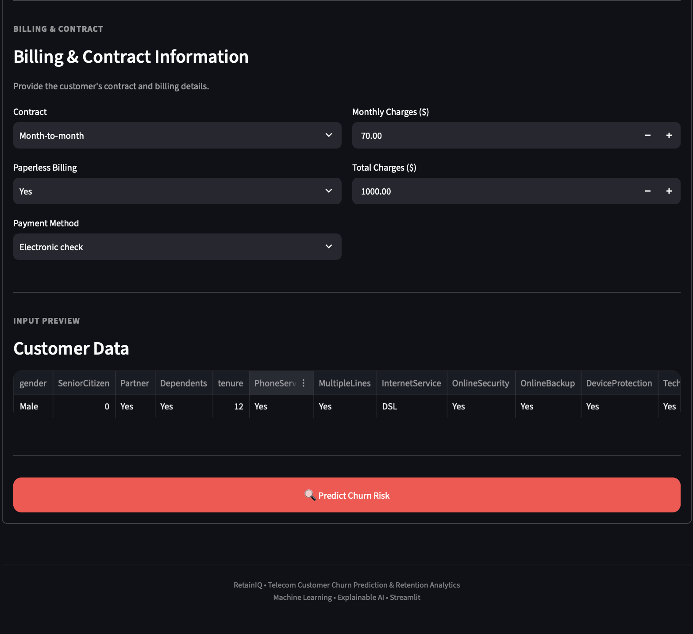
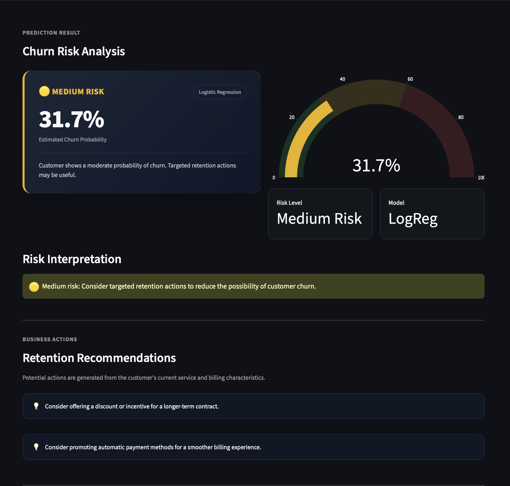
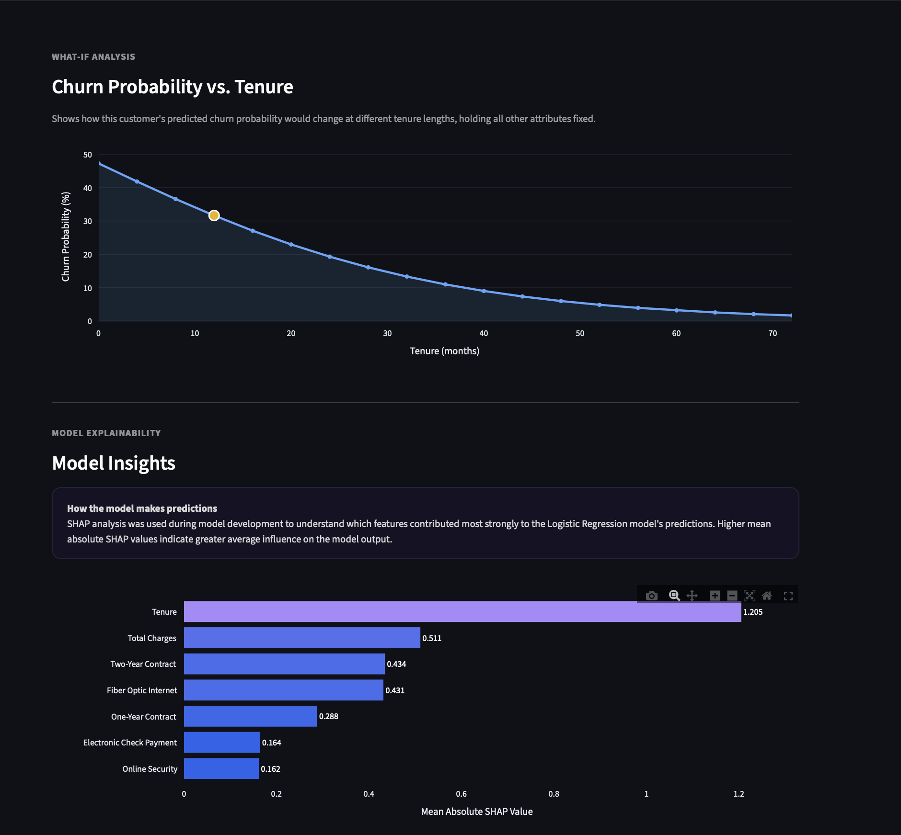

# RetainIQ — Telecom Customer Churn Prediction & Retention Analytics

RetainIQ is a machine learning project that predicts the probability of customer churn for a telecom company and provides data-driven retention recommendations.

The project covers data cleaning, exploratory data analysis, feature preprocessing, machine learning model comparison, cross-validation, SHAP-based explainability, and customer-level churn risk analysis through an interactive Streamlit dashboard.

---

## 📌 Problem Statement

Customer churn is a major challenge for telecom companies because losing existing customers can negatively impact revenue and customer lifetime value.

RetainIQ aims to identify customers who may be at risk of churning and provide actionable insights that can support customer retention strategies.

The system aims to:

- Predict the probability of customer churn.
- Classify customers into different risk levels.
- Identify important factors influencing churn predictions.
- Compare multiple machine learning classification models.
- Explain model predictions using SHAP.
- Generate customer-specific retention recommendations.
- Provide an interactive dashboard for churn risk analysis.

---

## 🎯 Objectives

1. Clean and preprocess telecom customer data.
2. Perform exploratory data analysis (EDA).
3. Handle numerical and categorical features using appropriate preprocessing techniques.
4. Train and compare multiple classification models.
5. Evaluate models using accuracy, precision, recall, F1-score, and ROC-AUC.
6. Use stratified cross-validation to evaluate model stability.
7. Apply SHAP for model explainability.
8. Build an interactive Streamlit dashboard.
9. Generate rule-based retention recommendations based on customer characteristics.

---

## 📊 Dataset

The project uses the **Telco Customer Churn** dataset.

The dataset contains customer information related to:

- Customer demographics
- Tenure
- Phone services
- Internet services
- Online security
- Online backup
- Device protection
- Technical support
- Streaming services
- Contract type
- Billing information
- Payment method
- Monthly charges
- Total charges
- Churn status

### Dataset After Cleaning

After data cleaning, the dataset contains:

- **7,032 customers**
- **19 input features**
- **1 target variable**

### Target Variable

```text
Churn
```

---

## 🖥️ Streamlit Dashboard

RetainIQ includes an interactive Streamlit dashboard that allows users to enter customer information, estimate churn probability, analyze risk levels, and view retention recommendations.

### Customer Profile & Inputs



### Billing & Prediction



### Churn Prediction Result

The dashboard displays the predicted churn probability, risk level, model used, and retention recommendations.



### What-If Analysis

The dashboard provides a what-if analysis showing how predicted churn probability changes with customer tenure while keeping other attributes fixed.



### Model Explainability & Performance

SHAP-based model insights are presented to show which features have the greatest average influence on the model output.


---

## 🛠️ Technology Stack

- **Programming Language:** Python
- **Data Analysis:** Pandas, NumPy
- **Data Visualization:** Matplotlib, Seaborn, Plotly
- **Machine Learning:** Scikit-learn, XGBoost
- **Model Explainability:** SHAP
- **Dashboard:** Streamlit
- **Model Serialization:** Joblib
- **Development:** Jupyter Notebook, VS Code

---

## 🤖 Machine Learning Models

Three classification models were trained and compared:

1. **Logistic Regression**
2. **Random Forest**
3. **XGBoost**

The models use a preprocessing pipeline with:

- One-hot encoding for categorical features
- Standardization of numerical features
- Train/test split with stratification
- Stratified 5-fold cross-validation

---

## 📈 Model Evaluation

Models were evaluated using:

- Accuracy
- Precision
- Recall
- F1-Score
- ROC-AUC
- Stratified 5-fold Cross-Validation

### Model Comparison

| Model | Accuracy | Precision | Recall | F1-Score | ROC-AUC | CV ROC-AUC |
|---|---:|---:|---:|---:|---:|---:|
| Logistic Regression | 80.31% | 64.74% | 56.95% | 60.60% | 83.62% | 84.59% |
| Random Forest | 77.26% | 56.14% | 66.04% | 60.69% | 82.08% | 83.00% |
| XGBoost | 78.18% | 60.50% | 51.60% | 55.70% | 82.48% | 84.26% |

Logistic Regression was used as the primary model for the Streamlit dashboard and SHAP analysis based on its ROC-AUC and cross-validation results.

---

## 🔍 Model Explainability

SHAP (SHapley Additive exPlanations) was used to analyze feature influence on the Logistic Regression model.

The analysis helps identify which features have the greatest average contribution magnitude to the model output.

The dashboard presents these insights through an interactive visualization.

---

## 💡 Retention Recommendations

RetainIQ generates rule-based retention recommendations based on customer characteristics such as:

- Contract type
- Payment method
- Internet service
- Technical support
- Online security
- Customer tenure
- Monthly charges

These recommendations are intended to demonstrate how machine learning predictions can be connected to potential business actions.

---

## 📂 Project Structure

```text
RetainIQ/
│
├── app/
│   └── app.py
│
├── data/
│   └── WA_Fn-UseC_-Telco-Customer-Churn.csv
│
├── models/
│   ├── logistic_regression.pkl
│   ├── random_forest.pkl
│   └── xgboost.pkl
│
├── notebooks/
│   ├── 01_data_cleaning.ipynb
│   ├── 02_eda.ipynb
│   ├── 03_feature_engineering.ipynb
│   └── 04_shap.ipynb
│
├── screenshots/
│   ├── dashboard_customer_profile.png
│   ├── dashboard_billing_prediction.png
│   ├── dashboard_prediction_result.png
│   ├── dashboard_what_if_analysis.png
│   └── dashboard_model_insights.png
│
├── .gitignore
├── requirements.txt
└── README.md
```

---

## ⚙️ Installation & Setup

```bash
# Clone the repository
git clone https://github.com/Nilesh-MV/RetainIQ.git
cd RetainIQ

# Create a virtual environment
python -m venv venv
source venv/bin/activate   # On Windows: venv\Scripts\activate

# Install dependencies
pip install -r requirements.txt
```

---

## ▶️ Running the Dashboard

```bash
cd app
streamlit run app.py
```

---

## 📌 Future Improvements

- Hyperparameter tuning for improved recall on the minority (churn) class
- Handling class imbalance with SMOTE or class-weight tuning
- Adding additional ensemble models (LightGBM, CatBoost)
- Deploying the dashboard on Streamlit Cloud / HuggingFace Spaces
- Adding automated retraining pipeline

---

## 🙋 Author

**Nilesh Vishwakarma**
B.E. Computer Engineering, University of Mumbai
